# 🏏 ICC Men's T20 Cricket World Cup 2022 — Data Analytics Dashboard


---

## 📌 Project Overview

This project is a comprehensive **Player Performance Analytics Dashboard** built on **ICC Men's T20 Cricket World Cup 2022** data. Using **Python** for web scraping and data preprocessing, and **Power BI** for visualization, the dashboard allows users to:

- 📊 **Analyse & compare** individual player performances across all World Cup matches
- 🧠 **Pick the best Final 11** from the entire tournament pool based on data-driven selection criteria
- 🔍 **Explore players by role** — Power Hitters, Anchors, Finishers, All-Rounders, and Specialist Fast Bowlers

> 💡 **To interact with the dashboard**, download the `.pbix` file from this repository and open it in **Power BI Desktop**.

---

## 📋 Table of Contents

- [Problem Statement](#-problem-statement)
- [Dataset Information](#-dataset-information)
- [Project Workflow](#-project-workflow)
- [Data Collection](#-data-collection)
- [Data Transformation](#-data-transformation)
- [Data Modelling](#-data-modelling)
- [DAX Measures](#-dax-measures)
- [Player Selection Criteria](#-player-selection-criteria)
- [Dashboard Screenshots](#-dashboard-screenshots)
- [Tools & Technologies](#-tools--technologies)

---

## ❓ Problem Statement

Cricket coaches, analysts, and fans often struggle to objectively compare player performances across different teams and conditions. This project solves that by building an **interactive Power BI dashboard** that:

- Reviews and compares **all player performances** from the T20 World Cup 2022
- Enables users to **build their dream Final 11** by selecting players from the full tournament pool
- Evaluates players based on **clearly defined, role-specific selection criteria** (batting average, strike rate, economy, etc.)

---

## 📂 Dataset Information

| Detail | Info |
|--------|------|
| **Source** | [ESPN Cricinfo](https://www.espncricinfo.com/) |
| **Scraping Tool** | Bright Data + BeautifulSoup |
| **Tournament** | ICC Men's T20 World Cup 2022 (Australia) |
| **Coverage** | Qualifier Stage + Super 12 |
| **Data Types** | Match results, batting summaries, bowling summaries, player info |

**Key files used:**
- `t20_batting_summary` — innings-level batting stats per player per match
- `t20_bowling_summary` — innings-level bowling stats per player per match
- `t20_players_info` — player metadata (team, batting style, bowling style, playing role)
- `t20_match_results` — match-level information and match IDs

---

## 🔄 Project Workflow

```
Requirement Scoping
      ↓
Web Scraping (ESPN Cricinfo via Bright Data + BeautifulSoup)
      ↓
Data Cleaning & Preprocessing (Python + Pandas)
      ↓
Data Transformation (Power Query in Power BI)
      ↓
Data Modelling & DAX (Power BI)
      ↓
Dashboard Building (Power BI)
```

---

## 🌐 Data Collection

- All match and player data was scraped from **[ESPN Cricinfo](https://www.espncricinfo.com/)** using **Bright Data** as the proxy/scraping infrastructure and **Beautiful Soup** as the HTML parser.
- Raw scraped data was in **JSON format**, which was converted into **Pandas DataFrames** using **Jupyter Notebook**, and then exported as **CSV files** for further processing in Power BI.

---

## 🧹 Data Transformation

Performed **two stages** of data transformation:

**Stage 1 — Python (Pandas):**
- Corrected player name inconsistencies
- Handled missing values
- Linked match IDs across batting and bowling tables

**Stage 2 — Power Query (Power BI):**
- Final data shaping and column renaming
- Merging datasets for model-ready tables
- Creating conditional columns for role-based filtering

---

## 🗃️ Data Modelling

All tables were connected using defined **primary keys**:
- `matchID` — links batting summary, bowling summary, and match results
- `team` — links player info to match data

Additional **calculated columns** and **parameters** were created to enable dynamic player selection and role-based filtering directly in the dashboard.

---

## ⚙️ DAX Measures

Below are the key DAX measures powering the dashboard:

### 🏏 Batting Measures

```dax
Total Runs = SUM(t20_batting_summary[runs])

Total Innings Batted = COUNT(t20_batting_summary[matchID])

Total Innings Dismissed = SUM(t20_batting_summary[Out])

Batting Avg = DIVIDE([Total Runs], [Total Innings Dismissed], 0)

Total Balls Faced = SUM(t20_batting_summary[balls])

Strike Rate = DIVIDE([Total Runs], [Total Balls Faced], 0) * 100

Batting Position = ROUNDUP(AVERAGE(t20_batting_summary[battingPos]), 0)

Boundary % = DIVIDE(SUM(t20_batting_summary[Boundary runs]), [Total Runs], 0) * 100

Avg. Balls Faced = AVERAGE(t20_batting_summary[balls])

Boundary Runs Batting = t20_batting_summary[fours] * 4 + t20_batting_summary[sixes] * 6
```

### 🎯 Bowling Measures

```dax
Wickets = SUM(t20_bowling_summary[wickets])

Balls Bowled = SUM(t20_bowling_summary[balls])

Runs Conceded = SUM(t20_bowling_summary[runs])

Economy = DIVIDE([Runs Conceded], ([Balls Bowled] / 6), 0)

Bowling Strike Rate = DIVIDE([Balls Bowled], [Wickets], 0)

Bowling Average = DIVIDE([Runs Conceded], [Wickets], 0)

Total Innings Bowled = DISTINCTCOUNT(t20_bowling_summary[matchID])

Dot Ball % = DIVIDE(SUM(t20_bowling_summary[zeros]), SUM(t20_bowling_summary[balls]), 0)

Boundary Runs Bowling = t20_bowling_summary[fours] * 4 + t20_bowling_summary[sixes] * 6
```

### 🧩 Dynamic Selection Measures

```dax
Player Selection = IF(ISFILTERED(t20_players_info[name]), "1", "0")

Display Text = IF([Player Selection] = "1", " ", "Select Player(s) by clicking the player's name to see their individual or combined strength")

Color Callout Value = IF([Player Selection] = "0", "#E8D166", "#1D1D2E")
```

---

## 🎯 Player Selection Criteria

One of the most powerful features of this dashboard is the ability to **build your own Final 11** using data-driven criteria. Each player role has a clearly defined set of **parameters and minimum thresholds** that a player must meet to be considered for that position.

> The criteria were defined as part of the **problem statement** and are used to filter and rank players across all 5 roles.

---

### 💥 Openers / Power Hitters

Openers need to score quickly right from ball one — they're evaluated on **high strike rate, good average, and boundary dominance**.

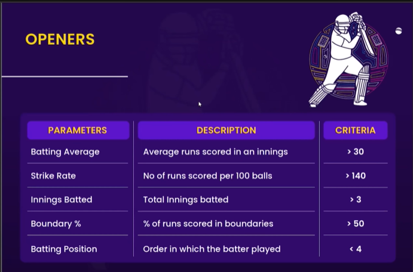

| Parameter | Description | Criteria |
|-----------|-------------|----------|
| Batting Average | Average runs scored in an innings | **> 30** |
| Strike Rate | No. of runs scored per 100 balls | **> 140** |
| Innings Batted | Total innings batted | **> 3** |
| Boundary % | % of runs scored in boundaries | **> 50** |
| Batting Position | Order in which the batter played | **< 4** |

---

### ⚓ Anchors / Middle Order

Anchors are the backbone of the batting lineup — they need **consistency and the ability to stay at the crease** while building partnerships.

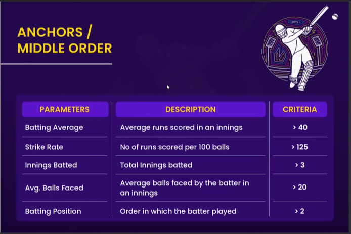

| Parameter | Description | Criteria |
|-----------|-------------|----------|
| Batting Average | Average runs scored in an innings | **> 40** |
| Strike Rate | No. of runs scored per 100 balls | **> 125** |
| Innings Batted | Total innings batted | **> 3** |
| Avg. Balls Faced | Average balls faced by the batter in an innings | **> 20** |
| Batting Position | Order in which the batter played | **> 2** |

---

### 🏁 Finishers / Lower Order Anchors

Finishers must be able to **accelerate at the death** and have the ability to contribute with the ball too.

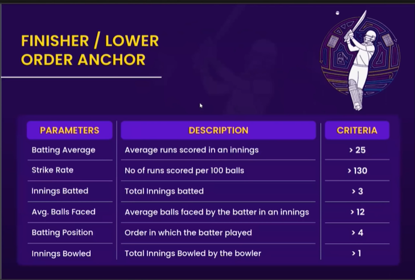

| Parameter | Description | Criteria |
|-----------|-------------|----------|
| Batting Average | Average runs scored in an innings | **> 25** |
| Strike Rate | No. of runs scored per 100 balls | **> 130** |
| Innings Batted | Total innings batted | **> 3** |
| Avg. Balls Faced | Average balls faced by the batter in an innings | **> 12** |
| Batting Position | Order in which the batter played | **> 4** |
| Innings Bowled | Total innings bowled by the bowler | **> 1** |

---

### 🔄 All-Rounders / Lower Middle Order

All-Rounders must contribute **both with bat and ball** — they're evaluated on a combined batting and bowling threshold.

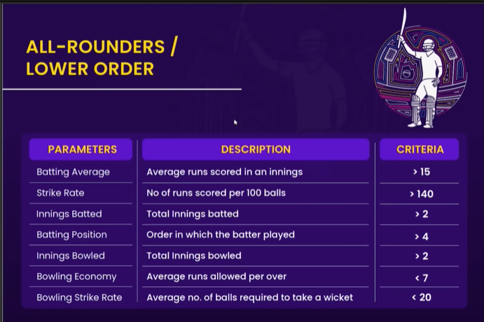

| Parameter | Description | Criteria |
|-----------|-------------|----------|
| Batting Average | Average runs scored in an innings | **> 15** |
| Strike Rate | No. of runs scored per 100 balls | **> 140** |
| Innings Batted | Total innings batted | **> 2** |
| Batting Position | Order in which the batter played | **> 4** |
| Innings Bowled | Total innings bowled | **> 2** |
| Bowling Economy | Average runs allowed per over | **< 7** |
| Bowling Strike Rate | Average no. of balls required to take a wicket | **< 20** |

---

### 🎳 Specialist Fast Bowlers / Tail End

Specialist fast bowlers are selected **purely on bowling performance** — economy, wicket-taking ability, and dot ball pressure are the key metrics.

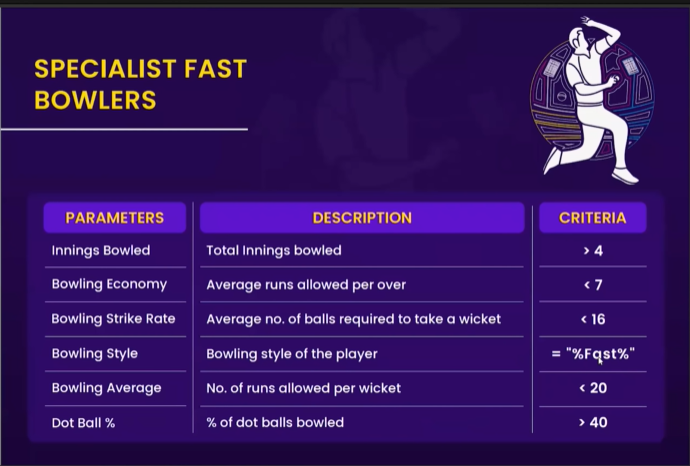

| Parameter | Description | Criteria |
|-----------|-------------|----------|
| Innings Bowled | Total innings bowled | **> 4** |
| Bowling Economy | Average runs allowed per over | **< 7** |
| Bowling Strike Rate | Average no. of balls required to take a wicket | **< 16** |
| Bowling Style | Bowling style of the player | **= "%Fast%"** |
| Bowling Average | No. of runs allowed per wicket | **< 20** |
| Dot Ball % | % of dot balls bowled | **> 40** |

---

## 📊 Dashboard Screenshots

### 🔢 Final 11 — Player Selection View
> Select any players from the full tournament pool on the left panel. The dashboard dynamically shows combined team performance metrics at the bottom.

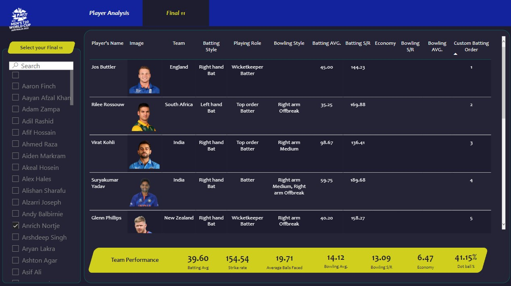


---

### 💥 Power Hitters / Openers
> Analysis of top-order batters evaluated on Runs, Strike Rate, Batting Average, Balls Faced, and Boundary %.

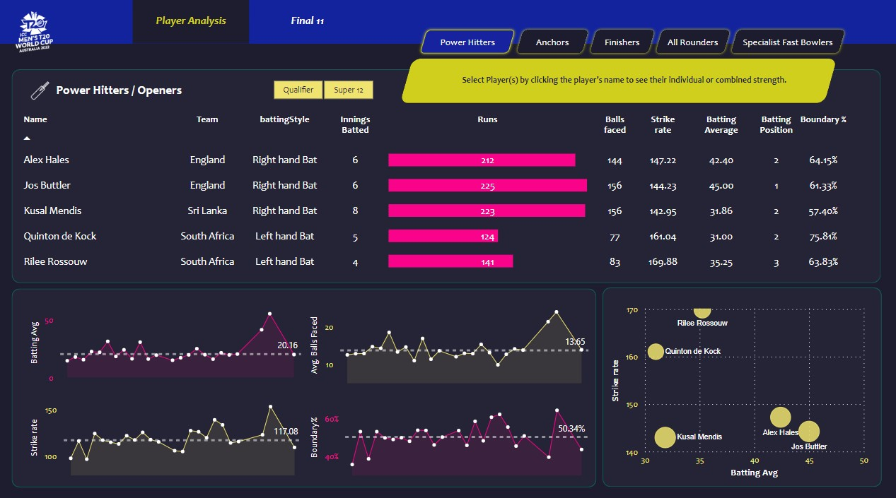

---

### ⚓ Anchors / Middle Order
> Middle-order batters assessed on consistency — Batting Average, Balls Faced, and Boundary contribution.

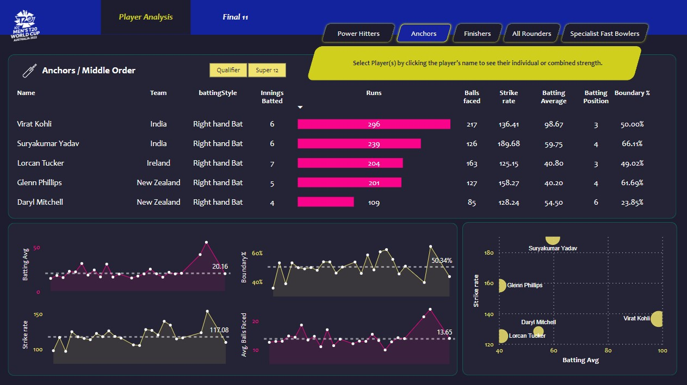

---

### 🏁 Finishers / Lower Order Anchors
> Players who can finish games evaluated on Strike Rate under pressure, Bowling contribution, and Average Balls Faced.

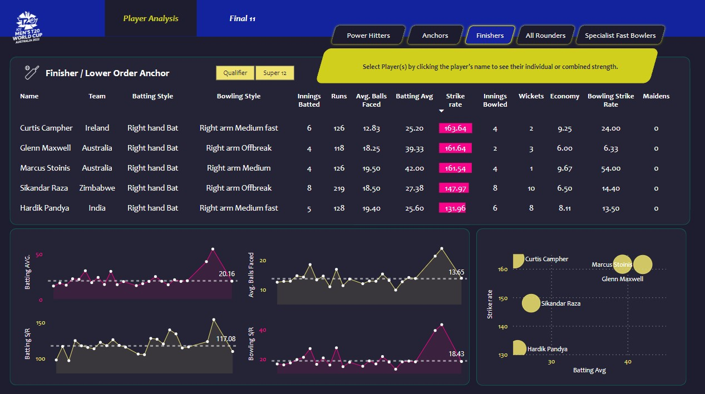

---

### 🔄 All-Rounders / Lower Middle Order
> Dual-threat players ranked by a combination of batting Strike Rate and bowling Economy.

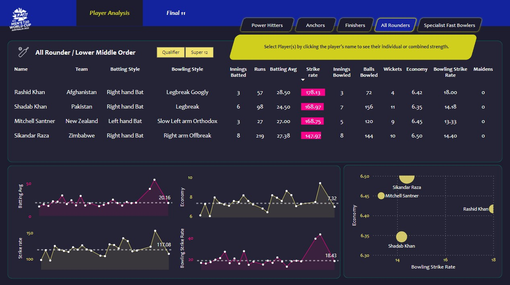

---

### 🎳 Specialist Fast Bowlers / Tail End
> Pure bowlers evaluated on Wickets, Economy, Bowling Strike Rate, and Dot Ball %.

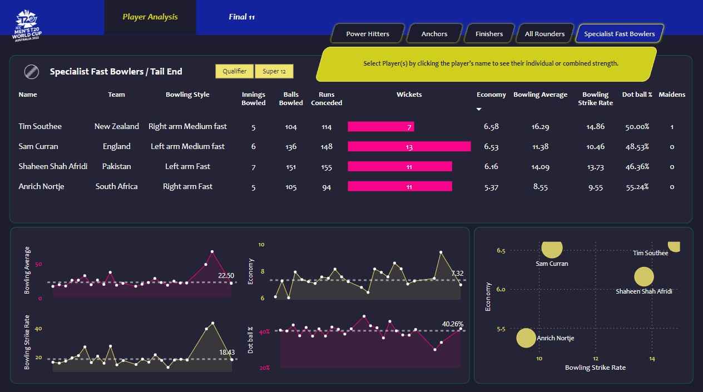

---

## 🛠️ Tools & Technologies

| Tool / Library | Purpose |
|----------------|---------|
| **Python** | Core scripting language |
| **Beautiful Soup** | HTML parsing and web scraping |
| **Bright Data** | Web scraping infrastructure |
| **Pandas** | Data cleaning and preprocessing |
| **Jupyter Notebook** | JSON-to-DataFrame conversion and EDA |
| **Microsoft Power BI Desktop** | Data transformation, modelling, DAX & dashboard |
| **Power Query** | Final data shaping inside Power BI |
| **DAX** | Measures and calculated columns |
| **ESPN Cricinfo** | Primary data source |

---

## 📎 References

- 📌 [ESPN Cricinfo — T20 World Cup 2022](https://www.espncricinfo.com/series/icc-men-s-t20-world-cup-2022-1298134)
- 📌 [Bright Data — Web Scraping Platform](https://brightdata.com/)
- 📌 [Microsoft Power BI Documentation](https://learn.microsoft.com/en-us/power-bi/)

---

## 🙌 Acknowledgements

Special thanks to the open cricket data community and ESPN Cricinfo for making match and player data accessible for analytical projects.

---

> ⭐ If you found this project useful, please give it a **star** on GitHub!